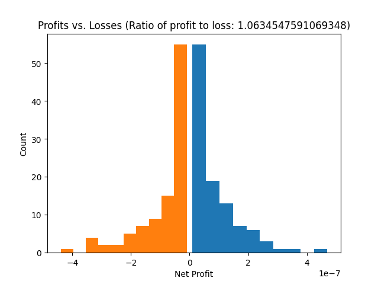

# CryptoTrader

This project implements an automated trading bot, which makes predictions on market movements, buys and sells cryptocurrency (or stocks) automatically, based on historical market data.

_Disclaimer: The project is experimental and still under development._

_Disclaimer: This is for educational purposes only and Orfeas Kypris does not bear any responsibility for any financial losses, or otherwise, incurred due to misuse of this code. Please use responsibly and at your own risk._

---

## Installation

The code runs on Python 3.7. To install dependencies, run _pip install -r requirements.txt_.

## Installation

### Python environment

#### Creating an environment

The recommended Python version for this project is Python 3.8. To create a `venv` environment and install the dependencies, run

```bash
make virtualenv
```

This will create a `venv` directory in the project root. You can then source that environment via

```bash
source $PROJECT_DIR/venv/bin/activate
```

where `PROJECT_DIR` contains the path to the project root folder.

Next up, we run

```bash
make data
```

to init the data directory.

#### Updating the dependencies

To add a new dependency update `unpinned_requirements.txt` and run

```bash
make update-requirements.txt
```

which will update the `requirements.txt`

## Usage

### Training the algorithm

You’ll start by training the algorithm using historical trading data. The code contains interfaces for two trading platforms, [Binance](http://www.binance.com) and [Cobinhood](http://www.cobinhood.com).

To start, from the root folder (cryptotrader), run:
_PYTHONPATH=. python3 src/classification/train_classifier.py_

This will do the following:

1. Download stock data based on the configuration you provide it within the _train_classifier.py_ file. Parameters are 1) time window (i.e. 19 Sep 2019 to 21 Sep 2019), 2) time interval (i.e. 1 min / 1 hour), 3) trading pair (i.e. ETHBTC). A typical filename where the stock data is saved is _local*data_19_Sep,\_2019_20_Sep,\_2019_XRPBTC_0:01:00*<class\_'binance.client.Client'>.dill_
2. Train the model using a random forest classifier fed with some custom extracted features of the time series, such as RSI, movnig average etc. The features are configurable through an abstract interface (for the brave).
3. Serialize the trained model onto classifier.dill file and save it in the $PROJECT_ROOT/data directory .

### Running the algorithm

The algorithm can be run in three main modes: offline, mock live, and live.

**Live** mode will place real orders, and requires an API key for the selected platform. The algorithm can be configured to place mock orders (Cobinhood exchange offers this feature), which is recommended in the beggining, to avoid implementing a wrong trading strategy. A typical _live_run.log_ looks like that:

```
DEBUG:cobinhood-api:cobinhood_api.http.chart fetch "get_candles"
INFO:root:Registering candle: Candle(Price(open_price=0.027499, high_price=0.027499, low_price=0.027499, close_price=0.027499 ),
Volume(volume=0.0, taker_buy_base_asset_volume=nan, taker_buy_quote_asset_volume=nan, quote_asset_volume=nan, number_of_trades=nan,  ),
Time(open_time=None, close_time=2019-09-07 23:51:00))
INFO:root:Prediction is: [ 1.] on iteration 0
INFO:root:Prediction for signal SignalSell(1.0 at DataPoint(0.027499,2019-09-07 23:51:00))
DEBUG:cobinhood-api:cobinhood_api.http.trading fetch "get_orders"
INFO:root:Previous signal was SignalBuy...
INFO:root:Current signal is SignalSell...
INFO:root:Last filled order is NoneType...
INFO:root:Open order is NoneType...
DEBUG:cobinhood-api:cobinhood_api.http.trading fetch "get_order_history"
INFO:root:Fetched last filled order...
INFO:root:Current signal is SignalSell and last filled order is OrderSell...
INFO:root:Doing nothing...
```

If an API key is not given, the client will not connect to the trading platform, and thus won't be able to fetch order information. A typical such error message is the following:
`__main__.CobinhoodError: Could not fetch last n orders. Reason: cache_key_not_exists`

**Offline** is recommended for debugging purposes and for getting quick results (for the impatient), which can then be readily analyzed, to evaluate trading strategy performance using various metrics. The disadvantage of this mode is that results are not representative of live trading, as slippage effects are not taking into account.

**Mock live** is used for troubleshooting purposes. It collects data from the live run, and replicates the live run by downloading the candles used in the live run as historical data and running the predictions on those. This can be useful for troubleshooting since sometimes exchanges may distort their historical data (on purpose?). Same disadvantages as with the offline mode holds.

All of the above modes save a log and trading performance data for further analysis.

---

## Postprocessing

Coming soon...

---

## Typical workflow

### Train the model using historical data

First, we run `PYTHONPATH=. python3 src/classification/train_classifier.py` which will download historical data, train a model and serialize the model to disk.

### Download some test data

Run `PYTHONPATH=. python3 src/connection/download_test_data.py` to download some test data (`test_data_long.dill`) into the `TEST_DATA_DIR` folder.

### Run inference on the time series

Then, we have to run the script `PYTHONPATH=. python3 src/run_offline.py `.

The relevant function call is

```python
path_to_portfolio, path_to_log = run_offline(TradingPair("XRP","BTC"),
                                                 100,
                                                 os.path.join(DATA_DIR, "test_data_long.dill"),
                                                 os.path.join(DATA_DIR, "offline_run.log"),
                                                 os.path.join(DATA_DIR, "classifier.dill"),
                                                 os.path.join(DATA_DIR, "offline_portfolio.dill"))
```

We need to make sure we are feeding it the correct inference data (`inference_data.dill`) and the trained classifier (`classifier.dill`), and this function will return the location of the generated portfolio dataframe (`path_to_portfolio`) and the log file for debugging (`path_to_log`).

### Evaluate the results

By running the script `PYTHONPATH=. python3 src/analysis_tools/generate_run_statistics.py -i data/offline_portfolio.dill`

We obtain the following output on stdout:

```bash
Classifier training period: 2019-09-19 00:00:00 2019-09-20 00:00:00
Run started on 1970-01-19 20:24:39.659999 and ended on 1970-01-19 20:26:12.779999
Trading pair start price: 2.837e-05, Trading pair finish price: 2.84e-05
Total number of buy/sell orders: 426
Gained 1.903419104688104 percent from trading within timeframe of 0:01:33.120000.
The asset price changed by 0.10574550581599583 percent within timeframe of 0:01:33.120000.
The net gains are 1.7976735988721082 percent within timeframe of 0:01:33.120000.
Profit per order pair: 0.004219891077164573
Profit to Loss ratio: 1.0634547591069348
```



As we can see, the classifier was somewhat successful in generating profit (+1.90% gains) in an uptrending market (+0.10% within the given timeframe).
